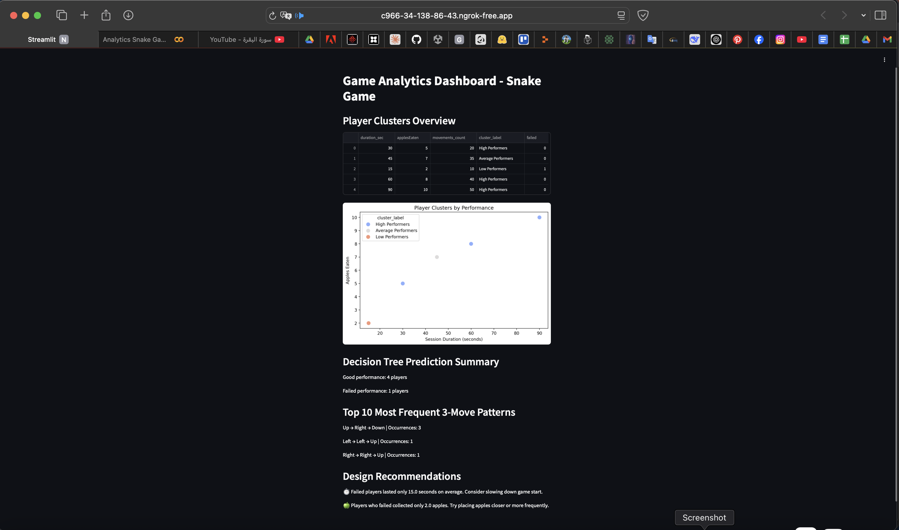

# 🎮 Player Insight: ML-Powered Game Analytics for Snake Game

By **Fatima Marie**  
AI Game Analytics Project – An-Najah National University  
📅 May 2025

---

## 📌 Project Overview

This project analyzes player behavior in a browser-based 2D Snake game by collecting gameplay data, applying machine learning to identify behavior patterns, predict failures, and generate design recommendations. The aim is to improve game design and player experience.

---

## 🧠 Objectives

- Collect real-time player data (location, direction, session time, failure reason).
- Cluster players into performance categories using K-Means.
- Predict player failure using Decision Trees.
- Extract movement and behavior patterns.
- Generate automatic design recommendations based on ML results.

---

## 📁 Folder Structure

```
Player-Insight-ML-Analytics/
🔜 game/           # HTML5 Snake Game with data tracking
🔜 data/           # Collected Player.json session files
🔜 notebooks/      # Google Colab notebook for data analysis
🔜 report/         # Final project report
🔜 dashboard/      # (Optional) Streamlit dashboard + ngrok
🔜 screenshots/    # Images for documentation/demo
🔜 requirements.txt
🔜 README.md
```

---

## ⚙️ Technologies Used

- 💻 HTML / CSS / JavaScript (game)
- 🐍 Python for data processing and ML
- 📆 scikit-learn (K-Means clustering, Decision Trees)
- 📊 pandas, matplotlib, seaborn (data analysis & visualization)
- 🌐 Streamlit (dashboard)
- 🔀 JSON (for session tracking)
- 🌍 ngrok (for sharing dashboard online)

---

## 🎩 How the Game Works

### 1. Game Setup
The original Snake game was modified to:

- Log each movement with (x, y), direction, and timestamp.
- Track direction changes.
- Record the failure reason (wall/self).
- Save the session hour and start time.
- Export a complete `Player.json` file after game over.

### 2. Data Collection
Players played 20+ test sessions. Each session generates a JSON file like:

```json
{
  "duration_ms": 15789,
  "startTime": "2025-05-19T15:42:00Z",
  "sessionHour": 15,
  "applesEaten": 5,
  "directionChanges": 3,
  "failReason": "wall",
  "movements": [...]
}
```

### 3. Data Analysis & Machine Learning
- All sessions are merged using pandas.
- Clustering with K-Means creates performance groups.
- Decision Tree model predicts player failure.
- Visual insights include:
  - Most used directions
  - Common failure positions
  - Player segmentation
  - Session time vs. performance

---

## 📊 Key Features

👉 Real-time session tracking  
👉 ML-driven clustering and prediction  
👉 Visual analytics and graphs  
👉 Automatic design recommendations  
👉 Optional interactive dashboard with Streamlit

---

## 📈 Example Insights

- 🔴 Most failures occur within the first 20 seconds.
- 🍏 Failed players collect fewer than 5 apples on average.
- 🧠 High performers eat >15 apples and survive >60 seconds.
- ↪️ Failed players rarely change direction.
- 🕗 Most failures happen between 8PM–11PM.

---

## ▶️ How to Run

### 🔹 Game
1. Open `index.html` from `/game/` in your browser.
2. Play the game — a download button appears after failure.
3. Save the `Player.json` file.

### 🔹 Data Analysis
1. Upload your JSON files into `/data/`.
2. Open the notebook in `/notebooks/` via Google Colab.
3. Run all cells to generate analysis, graphs, and predictions.

### 🔹 Dashboard (Optional)
```bash
pip install streamlit pyngrok
streamlit run dashboard/app.py
```

Use `ngrok` to expose the dashboard online if needed.

---

## 📷 Sample Screenshot



---

## 🧪 Machine Learning Techniques

- **K-Means Clustering** to segment players into High, Average, Low performance groups.
- **Decision Tree** to predict likely failure based on behavior.
- **Pattern Recognition**: Common sequences of movement (3-grams).
- **Automated Design Recommendations** based on analysis.

---

## 📄 Report & Video

- 📁 Full written report is in `/report/`  
- 🎥 3–5 min video demo explains project flow, gameplay, and insights

---

## 📚 References

- [scikit-learn](https://scikit-learn.org/stable/)
- [pandas](https://pandas.pydata.org/)
- [seaborn](https://seaborn.pydata.org/)
- [Streamlit](https://streamlit.io/)
- [Ngrok](https://ngrok.com/)
